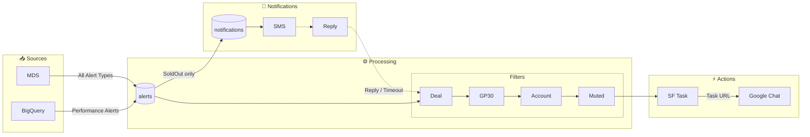
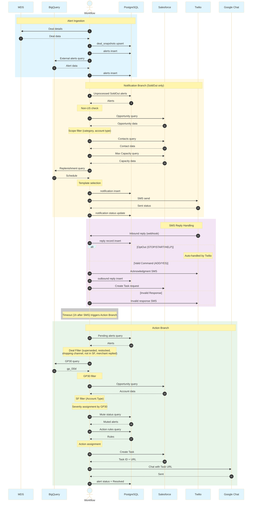

# Alert Lifecycle Flow Diagram

## High-Level Overview

## Detailed Flow

```mermaid
flowchart TB
    subgraph Sources["📥 ALERT SOURCES"]
        direction TB
        MDS["MDS API"]
        BQ["BigQuery"]
    end

    subgraph DealSnapshots["Deal Snapshots Ingestion"]
        DS1["Deal Details<br/>(MDS)"]
        DS2["deal_snapshots<br/>Upsert"]
        DS3["Alert Condition<br/>Detection"]
        DS4["alerts Insert"]
    end

    subgraph ExternalAlerts["External Alerts Ingestion"]
        EA1["da_all_alerts<br/>(BigQuery)"]
        EA2["Alert Type<br/>Mapping"]
        EA3["alerts Insert"]
    end

    MDS --> DS1
    DS1 --> DS2
    DS2 --> DS3
    DS3 --> DS4
    DS4 --> ALERTS

    BQ --> EA1
    EA1 --> EA2
    EA2 --> EA3
    EA3 --> ALERTS

    ALERTS[("alerts<br/>status = Pending")]

    subgraph NotificationBranch["📱 NOTIFICATION BRANCH (SoldOut Only)"]
        direction TB
        
        subgraph SoldOutNotifications["SoldOut Notifications"]
            N1["Unprocessed<br/>SoldOut Alerts"]
            N11{"Non US?"}
            N0["Opportunity<br/>Query (SF)"]
            N2{"Scope Filter• Valid Category<br/>• Valid Account"}
            N3["Contacts<br/>Query (SF)"]
            N4{"Valid Contact?"}
            N5["Max Capacity<br/>Query (SF)"]
            N6["Template<br/>Selection"]
            N7{"Replenishment<br/>Query (BigQuery)"}
            N8["Notification<br/>Created"]
            N9["notification_processed<br/>= true"]
            N10["Skipped"]
        end
    end

    ALERTS -->|"DealSoldOut /<br/>OptionSoldOut"| N1
    N1 --> N11
    N11 --> |No| N0
    N11 --> |Yes| N10
    N0 --> N2
    N2 -->|Pass| N3
    N2 -->|Fail| N10
    N10 --> N9
    N3 --> N4
    N4 -->|Yes| N5
    N4 -->|No| N10
    N5 --> N6
    N6 --> N7
    N7 -->|Yes| N10
    N7 -->|No| N8
    N8 --> N9

    NOTIF_DB[("notifications<br/>status = Created")]
    N9 --> NOTIF_DB

    subgraph SMSSender["📤 SMS Sending"]
        SMS1["Pending<br/>Notifications"]
        SMS2["Aggregated<br/>by Deal"]
        SMS3["Current Deal State<br/>(MDS)"]
        SMS4["Deduplicated"]
        SMS5{"Still Valid?"}
        SMS6{"Daily Limit?"}
        SMS7["SMS Sent"]
        SMS8["Status Updated"]
    end

    NOTIF_DB --> SMS1
    SMS1 --> SMS2
    SMS2 --> SMS3
    SMS3 --> SMS4
    SMS4 --> SMS5
    SMS5 -->|Yes| SMS6
    SMS5 -->|No| SMS8
    SMS6 -->|No| SMS7
    SMS6 -->|Yes| SMS8
    SMS7 --> SMS8

    subgraph SMSReply["📩 SMS Reply Handling"]
        R1["Inbound Reply<br/>(Twilio)"]
        R2["Reply Record<br/>Insert (DB)"]
        R0{"OptOut?<br/>STOP/START/HELP"}
        R0a["Twilio<br/>Auto-handled"]
        R3{"Valid Command?<br/>ADD / YES"}
        R4["Invalid Response<br/>Sent (Twilio)"]
        R5["Command Parsed"]
        R6["Acknowledgment<br/>Sent (Twilio)"]
        R7["Outbound Reply<br/>Insert (DB)"]
        R8["Create Task<br/>Request (SF)"]
    end

    SMS7 -.->|User Replies| R1
    R1 --> R2
    R2 --> R0
    R0 -->|Yes| R0a
    R0 -->|No| R3
    R3 -->|No| R4
    R3 -->|Yes| R5
    R5 --> R6
    R6 --> R7
    R7 --> R8

    subgraph ActionBranch["⚡ ACTION BRANCH"]
        direction TB
        
        subgraph ExecuteActions["Execute Actions"]
            subgraph DealFilter["Deal Filter"]
                DF0{"Alert Type<br/>Routing"}
                DF1["Non-SoldOut:<br/>Immediate"]
                DF2["SoldOut:<br/>After Reply/Timeout"]
                DF3{"Deal Context<br/>Filter"}
                DF3a["Filtered"]
            end
            
            subgraph GPFilter["GP30 Filter"]
                A3["GP30<br/>(BigQuery)"]
                A4{"Has GP30?"}
                A4a["Filtered"]
            end

            subgraph SFFilter["Salesforce Filter"]
                A5["Query Opportunity<br/>(SF)"]
                A6{"SF property Filter"}
                A6a["Filtered"]
            end

            A7["Severity by GP30"]
            subgraph MuteFilter["Mute Filter"]
                A8["Muted Alerts<br/>(DB)"]
                A9{"Muted?"}
                A9a["Muted"]
            end

            subgraph ActionAssignment["Action Assignment"]
                A10["Action Rules<br/>(DB)"]
                A11["Actions by<br/>type + severity"]
                A12{"Has Actions?"}
                A12a["NoAction"]
                A13["Execute Actions"]
            end
        end

        subgraph ExecuteAlertActions["Execute Alert Actions"]
            AA1["Actions Loop"]
            AA2["Action Record"]
            AA3["Render Templates"]
            AA4{"Action Type?"}
            AA5["Create SF Task"]
            AA6["Task URL<br/>Captured"]
            AA7["Chat Message<br/>with Task URL"]
            AA8["Send Chat<br/>(Google)"]
            AA9["Alert = Resolved"]
            AA10["Auto-mute specific alerts"]
        end
    end

    ALERTS --> DF0
    DF0 -->|"Non-SoldOut"| DF1
    DF0 -->|"SoldOut"| DF2
    DF1 --> DF3
    DF2 --> DF3
    
    R8 -.->|"Reply"| DF2
    SMS7 -.->|"Timeout (1h)"| DF2
    N9 -.->|"No Notification"| DF0

    DF3 -->|Pass| A3
    DF3 -->|Fail| DF3a
    A3 --> A4
    A4 -->|Yes| A5
    A4 -->|No| A4a
    A5 --> A6
    A6 -->|No| A7
    A6 -->|Yes| A6a
    A7 --> A8
    A8 --> A9
    A9 -->|No| A10
    A9 -->|Yes| A9a
    A10 --> A11
    A11 --> A12
    A12 -->|Yes| A13
    A12 -->|No| A12a

    A13 --> AA1
    AA1 --> AA2
    AA2 --> AA3
    AA3 --> AA4
    AA4 -->|SalesforceTask| AA5
    AA5 --> AA6
    AA6 --> AA7
    AA4 -->|Chat/ManagerChat| AA7
    AA7 --> AA8
    AA8 --> AA9
    AA9 --> AA10

    SF_TASK[("Salesforce Task")]
    GCHAT[("Google Chat")]

    AA5 --> SF_TASK
    AA8 --> GCHAT

    classDef source fill:#e1f5fe,stroke:#01579b,color:#01579b
    classDef process fill:#f3e5f5,stroke:#4a148c,color:#4a148c
    classDef decision fill:#fff3e0,stroke:#e65100,color:#e65100
    classDef dboutput fill:#e8f5e9,stroke:#1b5e20,color:#1b5e20
    classDef action fill:#fce4ec,stroke:#880e4f,color:#880e4f
    classDef notification fill:#fff8e1,stroke:#ff6f00,color:#bf360c
    classDef filtered fill:#ffcdd2,stroke:#b71c1c,color:#b71c1c
    classDef external fill:#b2ebf2,stroke:#00838f,color:#006064
    classDef dbop fill:#dcedc8,stroke:#558b2f,color:#33691e

    class MDS,BQ source
    class DS3,EA2,N1,N6,N10,R0a,R5 process
    class N2,N4,SMS5,SMS6,R0,R3,DF0,DF3,A4,A6,A9,A12,AA4,N11 decision
    class ALERTS,NOTIF_DB,SF_TASK,GCHAT dboutput
    class DF1,DF2,A7,A11,A13 process
    class AA1,AA3,AA6,AA7,AA9,AA10 action
    class SMS1,SMS2,SMS4,SMS7,SMS8 notification
    class R1,R4,R6 notification
    class DF3a,A4a,A6a,A9a,A12a filtered
    class DS1,EA1,N0,N3,N5,N7,SMS3,A3,A5,AA5,AA8,R8 external
    class DS2,DS4,EA3,N8,R2,R7,A8,A10,AA2,N9 dbop
```

## Sequence Flow

## Alert Types

| Alert Type | Source | Notification | Action Timing |
|------------|--------|--------------|---------------|
| DealSoldOut | MDS | ✅ SMS | After reply/timeout |
| OptionSoldOut | MDS | ✅ SMS | After reply/timeout |
| ConversionDropped | BigQuery | ❌ | Immediate |
| PerformanceDropped | BigQuery | ❌ | Immediate |
| OptionSelloutPredicted | BigQuery | ❌ | Immediate |
| DealEnded | MDS | ❌ | Immediate |
| DealEnding | MDS | ❌ | Immediate |

## Filter Conditions

### Deal Filter
Filters based on alert type and deal context:
- OptionSoldOut superseded by DealSoldOut
- OptionSelloutPredicted already restocked/sold
- Shopping channel deals
- Deals not in Salesforce (including 3pip)
- Merchant already replied to SMS
- Notification invalidated
- Previous sellout not yet restocked

### GP30 Filter
- Requires `gp_l30d` from BigQuery

### Salesforce Filter
- `Account.Type = 'Live'` → Filtered

### Mute Filter
- Account-level mute
- Opportunity-level mute
- Auto-mute 14 days after CVR/Perf resolution

### Notification Scope (SoldOut only)
- US Country only
- Valid account category/type
- Valid contact phone number
- No pending replenishment

## Action Types

| Action | Target | Notes |
|--------|--------|-------|
| SalesforceTask | Account Owner | Created first, provides Task URL |
| Chat | Account Owner | Includes Task URL link |
| ManagerChat | Manager | Includes Task URL link |
